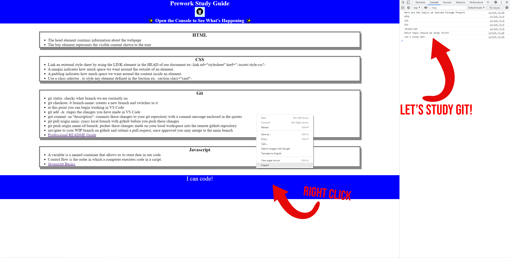

# Prework Study Guide Website

## Description

An interactive webpage containing all of the notes from the Bootcamp Prework. You'll find information and important links to help you learn HTML, CSS, Git Workflow, and Javascript.

## Installation

N/A

## Usage

To use this Prework Study Guide, you can review the notes in each section. For suggestions on what to study first, open the Chrome Devtools and tab over to 'Console'

## Credits

N/A

## License

Please refer to the LICENSE in the repo.

---
